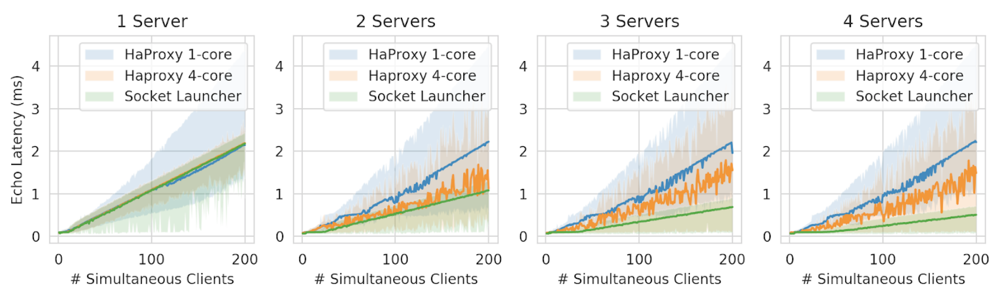

# Socket Launcher
Socket Launcher is a library for the rapid, transparent, and lossless transfer
of TCP connections between servers.

For a full description of setup and results, view the [presentation](Presentation.pdf).

Socket Launcher consists of two main components:
* The Socket Launcher proxy / load balancer:
 * Performs NAT, and balances incoming flows across servers
 * Allows for on-the-fly rerouting of flows
* Socket Launcher server(s)
 * Accepted and transferred sockets behave identically
 * Arbitrary number of possible endpoints

 

## Protocol

The socket launcher protocol consists of just four messages

* Xfer/xfered: Initiation and confirmation of the socket transfer process
* Redirect/redirected: Initiation and confirmation of proxy redirect process

Before the proxy has redirected the packets, server one will either buffer or
forward received packets on to server two, allowing the process to
proceed without loss of any individual packets.

## Selected Results

For graphs of all results, view the [presentation](Presentation.pdf).

### Proxy
The simple Socket Launcher eBPF proxy performs equally as well as a leading
industry standard proxy when used on few simultaneous connections.

As the connection pool grows in size, the Socket Launcher proxy
outperforms user-space proxies by 2x.

### Transfer
The efficacy of socket transfer was tested in the following scenario:

Multiple servers, each with a thread-pool, event-based model, serve
requests from clients, where a portion of those clients make
requests that take a disproportionately large amount of processing.

As the number of malicious clients approaches the number of total
threads present between the two hosts, queues are balanced more
evenly, and requests are served faster, and with more throughput

